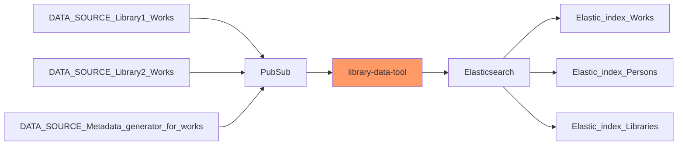

# Library Data Tool 📚 ⚒️

Convert data from library and related databases to formats to easily ingest into Elasticsearch

## Purpose 💖

Personal learning project to experiment with various solutions

## Workflow 🛤️

- Works: Book, Music, Film
- Persons: Author

## 1. Setup 🤖

Pre-condition 🪴

`npm install`

### Get Elasticsearch up and running locally

- Install Docker compose / Docker Desktop

- Navigate to the elasticsearch folder and run the docker-compose file `docker-compose up`

Stopping Elasticsearch

- To stop and preserve data `docker-compose down`

- To stop and delete data `docker-compose down -v`

To take advantage of the Norwegian Hunspell, and decompounder take a look at the provided example index template.

## 2. Use the app 🚀

### JSON -> NDJSON -> import file to Elasticsearch 💾

1. Run `node index`
2. Look for the generated file in [data/out](data/out)
3. Import this file to Elasticsearch

### JSON -> Elasticsearch client -> auto create index 🤖

1. Create index in Elasticsearch from existing JSON file: `node functions/elastic_create_index.js`
2. Verify the index was created in Elasticsearch Dev Tools: `GET game-of-thrones/_search` - note it currently updates dummy test data to the same index

## Credits 👏

- Example works data from [Deichman](https://deichman.no/)

## License 📝

The work is under exclusive copyright by default.
