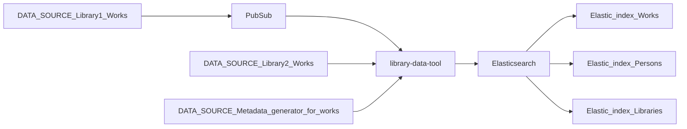

# Library Data Tool 📚 ⚒️

Convert data from library and related databases to formats to easily ingest into Elasticsearch

## Purpose 💖

Personal learning project to experiment with various solutions

## Workflow 🛤️

- Works: Book, Music, Film
- Persons: Author

## Usage 🤖

Pre-condition 🪴

`npm install`

Run app 🚀

`node index.js`

## Status 🚜

- Library works file: JSON -> NDJSON

## Credits 👏

- Example works data from [Deichman](https://deichman.no/)

## License 📝

The work is under exclusive copyright by default.
