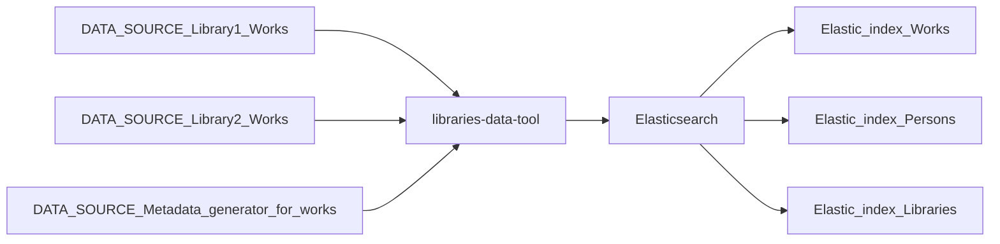

# Libraries Data Tool ⚒️

Convert data from library and related databases to formats to easily ingest into Elasticsearch

## Purpose 💖

Personal learning project to experiment with various solutions

## Workflow

- Works: Book, Music, Film

